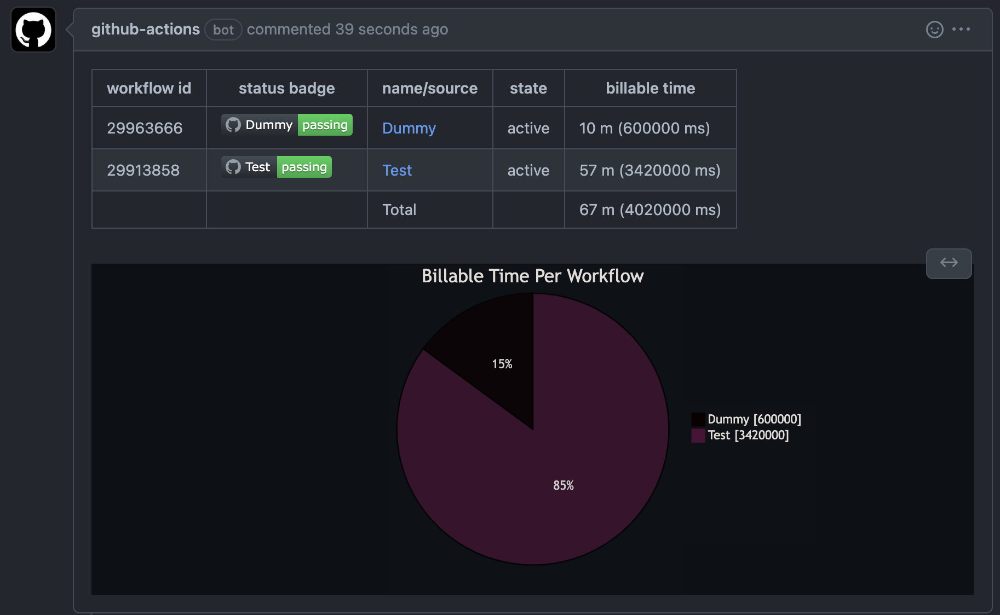

# Workflow Time Report

[](https://github.com/MichinaoShimizu/workflow-time-report/actions/workflows/test.yml)

Github Actions that outputs the aggregated results related to Billable Time of all workflows executed by the repository to ISSUE and JobSummary during the current month.



## Usage

```yaml
uses: MichinaoShimizu/workflow-time-report@v7.1.0
```

## Example

```yaml
name: Weekly Report Tasks

on:
  schedule:
    - cron: '0 1 * * 1'

  workflow_dispatch: 

jobs:
  reporting:
    runs-on: ubuntu-latest
    timeout-minutes: 5
    steps:
      - uses: actions/checkout@v3
      - uses: MichinaoShimizu/workflow-time-report@v7.1.0
```
